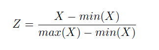
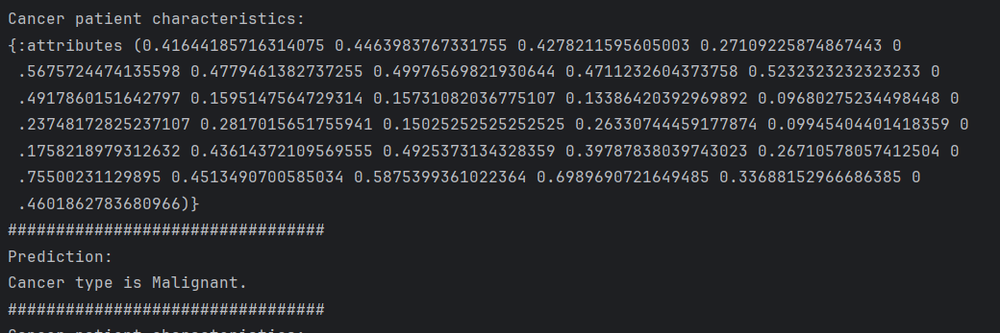
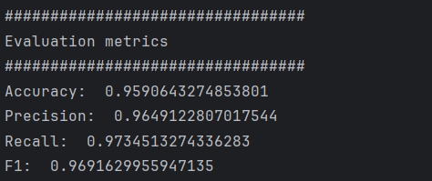

# breast-cancer-prediction-knn

__*Breast cancer prediction KNN*__ is a Clojure programming language project developed to give predictions of breast cancer type that patients, diagnosed with cancer, have.
Breast cancer is a condition where abnormal breast cells multiply uncontrollably, forming tumors. If not treated, these tumors can spread to other parts of the body and become life-threatening.
This tool aims to help doctors organizing breast cancer surgeries and radiation treatments based on whether the cancer type is benign or malignant.
Doctors will be able to make decisions - patients with cancer types that are malignant should be given higher priority for surgery in order to save their lives.


The dataset, stored in the CSV file Cancerdata.csv, includes details about patients diagnosed with cancer.
It contains a unique ID for each patient, the cancer type (diagnosis), features of the cancer, and the average values of these features.
Dataset contains 569 observations.

Key features of the dataset include:
- __id__ - unique identifier for each patient;
- __diagnosis__ - specifies the type of cancer, with possible values _"M" (Malignant) or "B" (Benign)_;
- __radius_mean, texture_mean, perimeter_mean, area_mean, smoothness_mean, compactness_mean, concavity_mean, concave points_mean__ - mean values representing various characteristics of the cancer. 

The dataset classifies cancer as benign or malignant based on these individual characteristics.

In order to predict whether a patient has malignant or benign breast cancer, we will use the KNN algorithm.

## K-Nearest Neighbors (KNN) algorithm

__*KNN algorithm*__ classifies a given example based on the k nearest examples in its vicinity.
The algorithm operates on the assumption that patients with similar characteristics are likely to have the same type of cancer.
By analyzing neighbourhood relationships within the dataset, KNN can be effectively applied to cancer diagnosis.

In KNN, the outcome (response) for a given observation is determined by the outcomes of its k nearest neighbors.
To identify the closest neighbours, the algorithm calculates the similarity or distance (in this case Euclidean distance)
between pairs of observations, where each observation is represented as a vector of its feature values.

For classification tasks, KNN assigns a new observation to the class most frequently found among its k nearest neighbors also known as majority voting.

## Project organization

All business logic is organized through following files:

1. __Load data__ - functions for loading data from .csv file
2. __Data transformation__ - functions for transforming the data for further use
3. __Data manipulation__ - functions for presenting dataset
4. __Data normalization__ - function for normalizing the data (prerequisite for KNN)
5. __Train and test split__ - function for dividing dataset to train and test dataset - one for training the KNN model, one for testing the algorithm
6. __KNN model__ - functions needed for KNN
7. __Evaluation metrics__ - functions for calculation statistic measures: accuracy, precision, callback and F1.
8. __Core__ - this file includes calling all of these functions and represent the usage of them

## Project usage

To run the project and see the final prediction results, go to __*core.clj*__ file and run *REPL* from there.

### Code explanation
In order to use the KNN algorithm and predict the type of breast cancer,
it is necessary to first load the csv file containing the data that KNN model will work with:
```clojure
;;;;;;;;;;;;;;;;;;;;;;;;;;;;;;;;;;;;;;;;;;;;;;;;;;;;;;;;;;;;;;;;;;;
;;;;;; LOADING DATA and DATA TRANSFORMATION
;;;;;;;;;;;;;;;;;;;;;;;;;;;;;;;;;;;;;;;;;;;;;;;;;;;;;;;;;;;;;;;;;;;

(def csv-file "src/breast_cancer_prediction_knn/Cancerdata.csv")
(def cancer-data (load-data/convert-dataset csv-file))
```
Definition of the function *convert-dataset* that is used here is stored in __data_transformation.clj__ file.
This function converts the value of each observation in the dataset to the true data type and returns the converted dataset.

For purposes to presenting and printing data in console some functions are also created:

```clojure
;;;;;;;;;;;;;;;;;;;;;;;;;;;;;;;;;;;;;;;;;;;;;;;;;;;;;;;;;;;;;;;;;;;
;;;;;; PRINTING and PRESENTING DATA
;;;;;;;;;;;;;;;;;;;;;;;;;;;;;;;;;;;;;;;;;;;;;;;;;;;;;;;;;;;;;;;;;;;

(doseq [row (take 10 cancer-data)]
 (println row))

(println "Dataset Information:")
(println (data-man/dataset-info cancer-data))

(println "\nColumn 'diagnosis':")
(println (data-man/get-column cancer-data "diagnosis"))

(println "\nLast 5 rows of the dataset:")
(println (data-man/last-rows cancer-data 5))
```
These functions are stored in __data_manipulation.clj__ file.
Now we can see general information about the dataset - number of columns, number of rows and header (names of columns).
Also, we can print a particular column that we are interested in.

For prediction, we need only columns that are predictors.
In the dataset there is an ID column that is not needed for prediction, so it must be removed:

```clojure
;;;;;;;;;;;;;;;;;;;;;;;;;;;;;;;;;;;;;;;;;;;;;;;;;;;;;;;;;;;;;;;;;;;
;;;;;; DATA MANIPULATION
;;;;;;;;;;;;;;;;;;;;;;;;;;;;;;;;;;;;;;;;;;;;;;;;;;;;;;;;;;;;;;;;;;;
;Id column is not needed for prediction
(def cleaned-data
 (data-man/drop-column cancer-data "id"))

(println "Cleaned data (column 'id' dropped):")
(println cleaned-data)

```

Also, for further steps column *diagnosis*, which currently have values *"M"* and *"B"*,
will be now encoded with values 1 and 0:

```clojure
;;;;;;;;;;;;;;;;;;;;;;;;;;;;;;;;;;;;;;;;;;;;;;;;;;;;;;;;;;;;;;;;;;;
;;;;;; DIAGNOSIS CHANGE FROM M or B TO 1 or 0
;;;;;;;;;;;;;;;;;;;;;;;;;;;;;;;;;;;;;;;;;;;;;;;;;;;;;;;;;;;;;;;;;;;

(def encoded-data (data-man/encode-diagnosis cleaned-data)) ;; Encodes "diagnosis" column

(println "Encoded Data:")
(doseq [row (take 10 encoded-data)]
 (println row))

```

Previously mentioned functions are stored in __data_manipulation.clj__ file.

Now we have a dataset that must be standardized for KNN model purposes.
Since we do not have outliers here, we will use normalization.

Normalization reduces variable values to a value range [0,1].
This is done using the formula:



```clojure
;;;;;;;;;;;;;;;;;;;;;;;;;;;;;;;;;;;;;;;;;;;;;;;;;;;;;;;;;;;;;;;;;;;
;;;;;; DATA NORMALIZATION
;;;;;;;;;;;;;;;;;;;;;;;;;;;;;;;;;;;;;;;;;;;;;;;;;;;;;;;;;;;;;;;;;;;

(def normalized-data (data-norm/normalize-data encoded-data))
```

You can see in __data_normalization.clj__ file how this formula is transformed in clojure function:

```clojure
(defn normalize-data
 "Normalizes the data (excluding header)."
 [data]

 (let [headers (data-man/get-headers data)
       rows (rest data)
       ;; Transpose rows to get columns
       columns (apply map vector rows)


       normalized-columns
       (mapv
         (fn [col]
           (if (every? number? col) ;; Only if the column contains numeric values
             (let [min-val (apply min col)
                   max-val (apply max col)
                   range (- max-val min-val)]
               (mapv #(if (zero? range) 0.0
                                        (/ (- % min-val) range))
                     col))
             col)) ;; If not numeric, leave the column unchanged
         columns)
       ;; Transpose normalized columns back into rows
       normalized-rows (apply map vector normalized-columns)]
   ;; Add headers back to the normalized data
   (cons headers normalized-rows)))

```

Now when everything is prepared for KNN prediction, the dataset must be split into *train dataset and test dataset*.

Train dataset will be used for training the model and the test dataset will be used for prediction of diagnosis for cancer type.

```clojure
;;;;;;;;;;;;;;;;;;;;;;;;;;;;;;;;;;;;;;;;;;;;;;;;;;;;;;;;;;;;;;;;;;;
;;;;;; TRAIN AND TEST DATA
;;;;;;;;;;;;;;;;;;;;;;;;;;;;;;;;;;;;;;;;;;;;;;;;;;;;;;;;;;;;;;;;;;;

(def split-data (tts/train-test-split (rest normalized-data) 0.7))

(println "Train data:" (:train split-data))
(println "Test data: " (:test split-data))

```

The *train-test-split* function is stored in __train_and_test_split.clj__ file, and it looks like this:

```clojure
(defn train-test-split
 "Splits dataset into test and train datasets"
 [data p]

 (let [n (count data)
       size (int (* n p))
       shuffled-data (shuffle data)]
   {:train (subvec shuffled-data 0 size)
    :test (subvec shuffled-data size n)}))

```

To separate the attributes that are predictors from the column that actually represents the output,
we will transform the data from the train dataset and test dataset as follows:

```clojure
(def transformed-train-data (tts/transform-data (:train split-data)))
(def transformed-test-data (tts/transform-data (:test split-data)))

(println transformed-train-data)

(println transformed-test-data)

;test data without final results
(def transformed-test-data-without-class (tts/transform-data-without-class transformed-test-data))
(println transformed-test-data-without-class)
```

These two functions are also stored in __train_and_test_split.clj__ file:

```clojure
(defn transform-data
 "Transforms dataset into a structured format - attributes and cancer type (diagnosis column of dataset)"
 [data]

 (mapv (fn [sample]
         (let [attributes (map #(Double/parseDouble (str %)) (subvec sample 1 31))
               cancer-type (if (= (nth sample 0) "1") :M :B)]
           {:attributes attributes
            :cancer-type cancer-type}))
       data))

(defn transform-data-without-class
 "Extracting only attributes from structured dataset"
 [data]

 (mapv (fn [sample]
         {:attributes (map #(Double/parseDouble (str %)) (:attributes sample))})
       data))
```

Here we can see that cancer type class will have values __:M__ if the column diagnosis has value __1__ and __:B__ if column diagnosis has value __0__.

Test dataset does not need a class column because we want to predict which class will be included in every observation with KNN algorithm,
so we would exclude class from it.

Now we can train the KNN model for prediction of proper diagnosis based on cancer patient characteristics:

```clojure
(def train-data transformed-train-data)
(println train-data)
(def test-data transformed-test-data-without-class)

(doseq [cancer-patient test-data]
 (let [k 3
       predicted-class (knn/knn train-data (:attributes cancer-patient) k)]
   (println "Cancer patient characteristics:")
   (println cancer-patient)
   (println "#################################")
   (println "Prediction:")
   (if (= predicted-class :M)
     (println "Cancer type is Malignant.")
     (println "Cancer type is Benign."))
   (println "#################################")))

```

In console, you can see printed characteristics of patient and predicted diagnosis (class):


KNN algorithm uses K nearest neighbours that are defined with Euclidean distance.
You can see these functions in __knn_model.clj__ file:

```clojure
(defn euclidean-distance
 "Calculates the Euclidean distance between two vectors"
 [first-vector second-vector]

 (Math/sqrt (reduce + (map #(* % %) (map - first-vector second-vector)))))

(defn nearest-neighbors
 "Finds k nearest neighbours"
 [train-data new-data k]

 (take k
       (sort-by :distance
                (map #(assoc % :distance (euclidean-distance (:attributes %) new-data)) train-data))))

(defn knn
 "KNN classification algorithm"
 [train-data new-data k]

 (let [nearest-neighbors (nearest-neighbors train-data new-data k)
       classes (map :cancer-type nearest-neighbors)
       frequencies (frequencies classes)]
   ;; Sort the frequencies map by values (the counts) and get the class with the highest count
   (key (first (sort-by (fn [[_ v]] v) > frequencies)))))

```

After model training, test dataset must be used for checking is KNN model predict true diagnosis for observation in this dataset or not.

For that purposes, we will separate actual diagnosis from test dataset and compare it with predicted diagnosis with KNN algorithm:

```clojure
(def actual-data (map :cancer-type transformed-test-data))

(println "Actual data:")
(println actual-data)

(def predicted-data
 (map #(knn/knn train-data (:attributes %) 3) test-data))

(println "Predicted data:")
(println predicted-data)
```

For a more comprehensive comparison of actual and predicted data,
we will use evaluation metrics that will calculate how much data is well predicted and how much is not:

```clojure
;;;;;;;;;;;;;;;;;;;;;;;;;;;;;;;;;;;;;;;;;;;;;;;;;;;;;;;;;;;;;;;;;;;;
;;;;;;; Evaluation of predicted and actual results
;;;;;;;;;;;;;;;;;;;;;;;;;;;;;;;;;;;;;;;;;;;;;;;;;;;;;;;;;;;;;;;;;;;;

(def evaluation-metrics (eval-met/calculate-measures actual-data predicted-data)) (eval-met/calculate-measures actual-data predicted-data)
(println "#################################")
(println "Evaluation metrics")
(println "#################################")
(println "Accuracy: " (get evaluation-metrics :accuracy)
        "\nPrecision: " (get evaluation-metrics :precision)
        "\nRecall: " (get evaluation-metrics :recall)
        "\nF1: " (get evaluation-metrics :f1))

```

Function calculate-measures is stored in __evaluation_metrics.clj__ file:

```clojure
(defn true-positive
  "Calculates how many Benign predicted diagnosis are also Benign actual diagnosis"
  [actual-values predicted-values]

  (count (filter (fn [[actual predicted]] (and (= actual :B) (= predicted :B))) (map vector actual-values predicted-values))))

(defn true-negative
  "Calculates how many Malignant predicted diagnosis are also Malignant actual diagnosis"
  [actual-values predicted-values]

  (count (filter (fn [[actual predicted]] (and (= actual :M) (= predicted :M))) (map vector actual-values predicted-values))))

(defn false-positive
  "Calculates how many Benign predicted diagnosis are Malignant actual diagnosis"
  [actual-values predicted-values]

  (count (filter (fn [[actual predicted]] (and (= actual :M) (= predicted :B))) (map vector actual-values predicted-values))))

(defn false-negative
  "Calculates how many Malignant predicted diagnosis are Benign actual diagnosis"
  [actual-values predicted-values]

  (count (filter (fn [[actual predicted]] (and (= actual :B) (= predicted :M))) (map vector actual-values predicted-values))))

(defn calculate-measures
  "Calculates accuracy, precision, recall, and F1 score based on actual and predicted values."
  [actual predicted]

  (let [fp (false-positive actual predicted)
        tp (true-positive actual predicted)
        fn (false-negative actual predicted)
        tn (true-negative actual predicted)]
    (let [accuracy (double (/ (+ tp tn) (+ tp tn fp fn)))
          precision (double (if (zero? (+ tp fp)) 0 (/ tp (+ tp fp))))
          recall (double (if (zero? (+ tp fn)) 0 (/ tp (+ tp fn))))
          f1 (double (* 2 (/ (* precision recall) (+ precision recall))))]
      {:accuracy accuracy
       :precision precision
       :recall recall
       :f1 f1})))
```

In this call of function we had the following results:



Based on these numbers we can conclude that accuracy of prediction is very high and that is good.
The model accurately predicted the output variable, in this case out of 569 cancer patients the KNN model correctly predicted 546,
i.e. for 95.9% of patients have correctly predicted diagnosis (Malignant or Benign cancer type).


## Testing functions

All functions that are created for the purpose of this project are tested with
the Midje library (https://github.com/marick/Midje).
In the __test folder__ there are files organized in the same way as the __src folder__.
These folder contains 62 tests that cover cases of function calls.

You can start the test by entering following command in terminal:

```
lein midje
```

## Conclusion

The KNN algorithm produced excellent results for this dataset, as evidenced by the calculated performance metrics:


The results of the KNN model may vary depending on how the dataset is shuffled.
In the tests conducted, accuracy ranged between 94% and 97%, which is still highly reliable for prediction.

In conclusion, the __*Breast cancer prediction KNN*__ system proves to be a valuable tool for accurately classifying
the type of breast cancer based on the characteristics involved in diagnosing patients.


## License

Copyright © 2024 nevena-cvijovic
